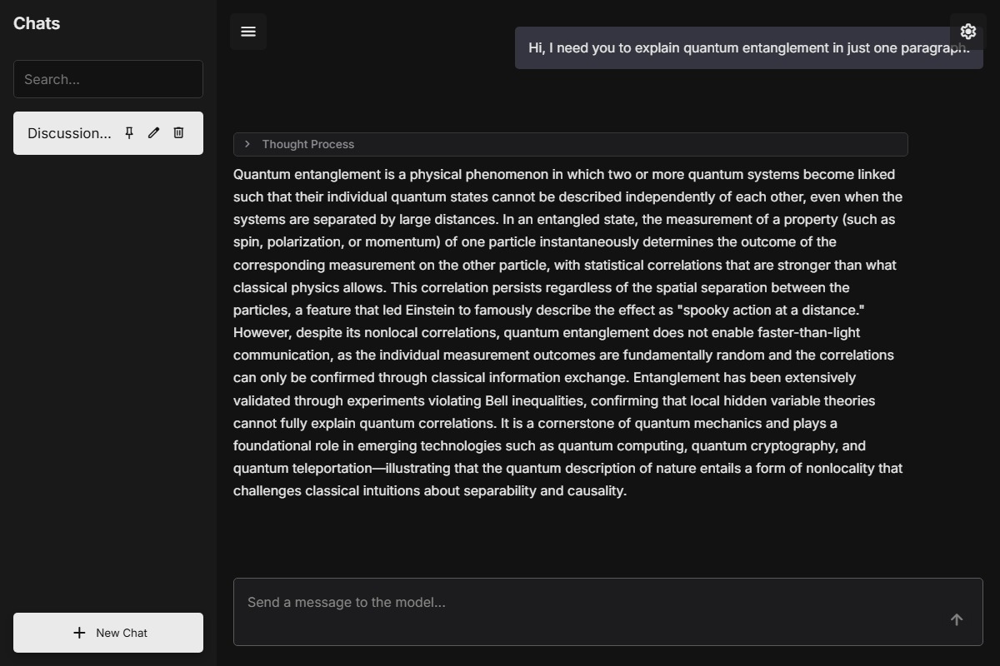

# FloeLM

    
    
    
    
    
    

> [!CAUTION]
> **This is an early preview version of FloeLM. Not recommended for production use.**

Example of a lightweight and customizable intelligent assistant front-end project.

[Demo on GitHub.io](https://floebot.github.io/FloeLM)

**Make the following modifications:**
- The toolbar has complete functionality.  
- Supports long conversations and one click context clearing.  
- Mackdown real-time parsing.  
- Support stopping thinking and dialogue editing.

**Upcoming features:**
- Display detailed information.  
- Multi model switching.  
- Image recognition and visual model support.
